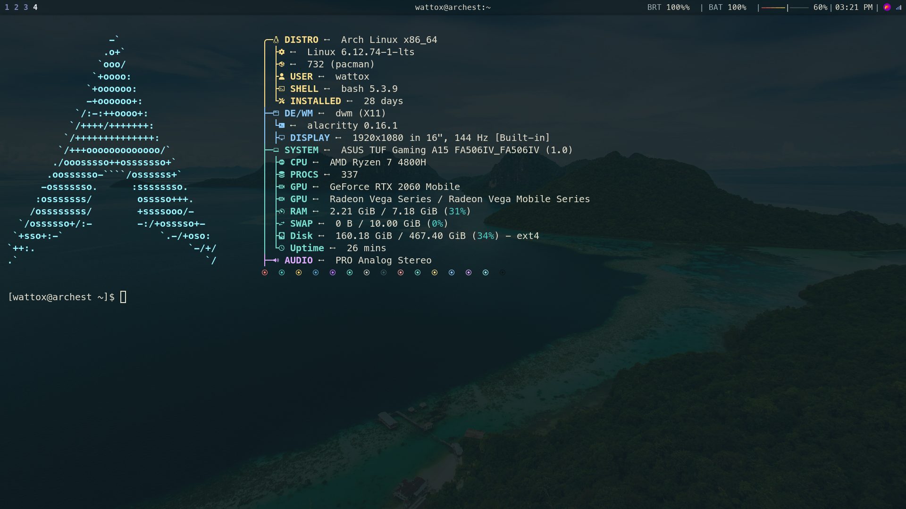
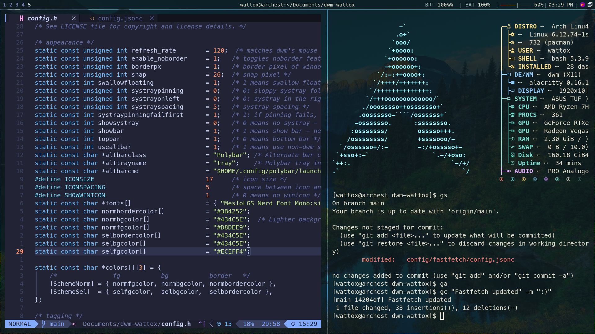
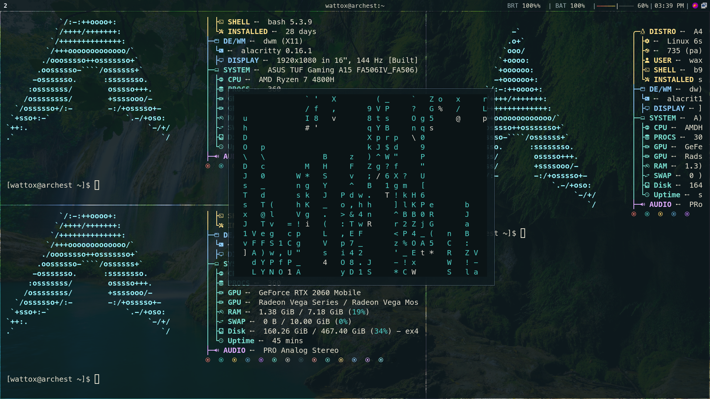

# My modified dwm



This is my **HEAVILY MODIFIED** version of dwm. It is based on the original [dwm-titus](https://github.com/ChrisTitusTech/dwm-titus) dwm window manager just fine tuned for my preferances.

## Installation

1. Assuming you have a base TTY set up with internet and other stuff ( I would recommend christitus arch server setup for that )
2. After a fresh login write these commands:
    ```bash
    git clone https://github.com/WattoX00/arch-setup.git

    cd /arch-setup

    chmod +x dwm-wattox.sh

    bash dwm-wattox.sh
    ```
3. This will run the isntallation script and will ask for sudo permission a few times

See here what it will install: [ArchSetup](https://github.com/WattoX00/arch-setup)





## ❤️ Support

If this project saved you time, taught you something, or made your day a little easier,
you can support its development here:

👉 **[Buy me a coffee via PayPal](https://www.paypal.com/paypalme/wattox)**

Your support helps keep the project:
- Actively maintained
- Continuously improved
- Free and open source

Thanks for being part of the community 🤝

## 📄 License

This project is licensed under the **MIT License**.  
See the [LICENSE](LICENSE) file for full details.
